OTRon is a Chrome extension which allows you to encrypt chats on facebook.com with one click.

# Installation and generation
When you install OTRon, it immediately generates three things: a *key pair*, a *security token*, and a *security color*.

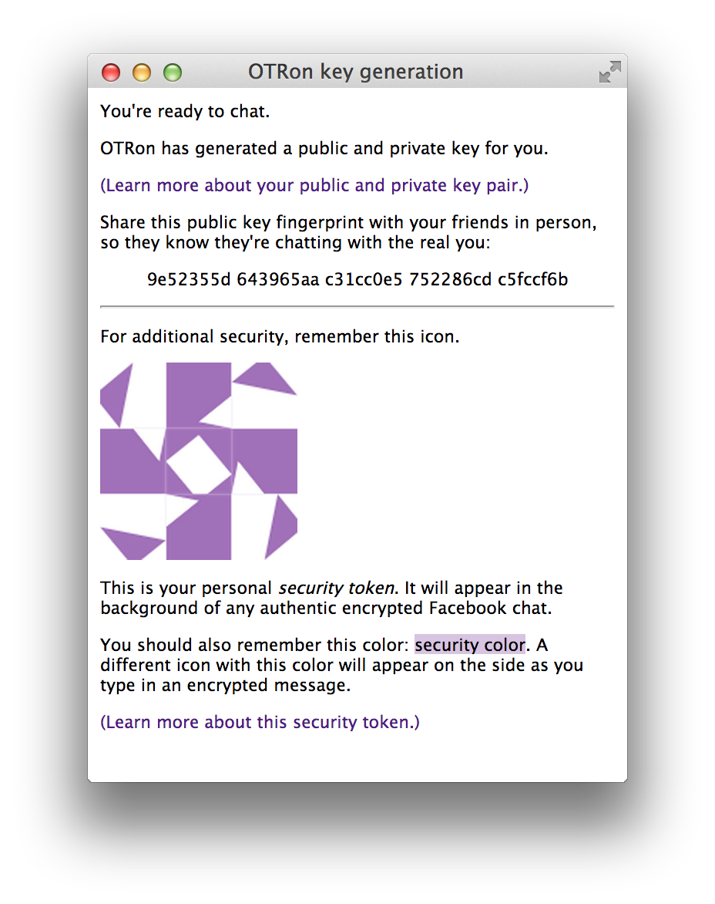</img>

## Key pair
The key pair (made up of a *public* and *private* key) is the most important item. It's what OTRon will use to encrypt your conversations. For now, you only need to know about one part of that key pair: your public key -- more specifically, the *fingerprint* of your public key.

Share that fingerprint as widely as possible! People can compare against it during encrypted chats to make sure they're talking to the real you. (We'll get to how *you* do that when talking to other people soon.)

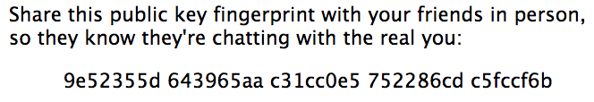</img>

## Security token and color
The security token and color protect you against "phishing" or "redress" attacks, where an attacker tries to trick you.

Here's an example of a redress attack. Suppose Facebook wants to know what you and your friend are talking about. Normally, when you send a message in OTRon, it goes through OTRon's overlay on top of Facebook chat. We encrypt it and then relay it to Facebook, so Facebook would have a coded message they can't read.

But Facebook could put a compromised place to type messages in, and layer it right on top of OTRon's overlay. Then you'd type your message in there, and Facebook would get it!

The security token and color mark secure places in Facebook where OTRon is in control. Facebook has no way of knowing what your security token and color are, so if you remember to only go for places marked with your token and color when you want security, they can't trick you.

# Encrypting a chat
Let's start with a typical unencrypted Facebook chat. OTRon makes one change -- it adds a little lock icon in the top-right part of the chat box.

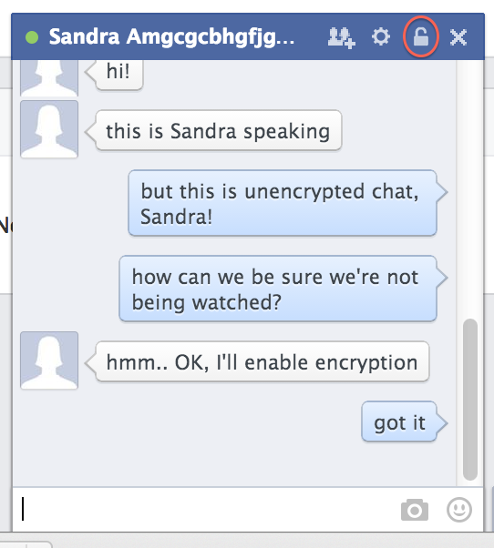</img>

OK. Now Sandra will enable encryption in her chat with Barbara.

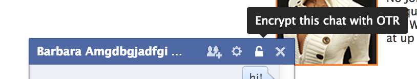</img>

It may take a few seconds to resolve everything. If the negotiation times out, you can unlock and try again.

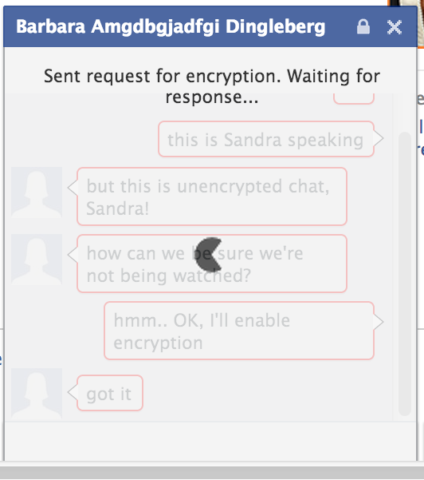</img>

Now we're encrypted!

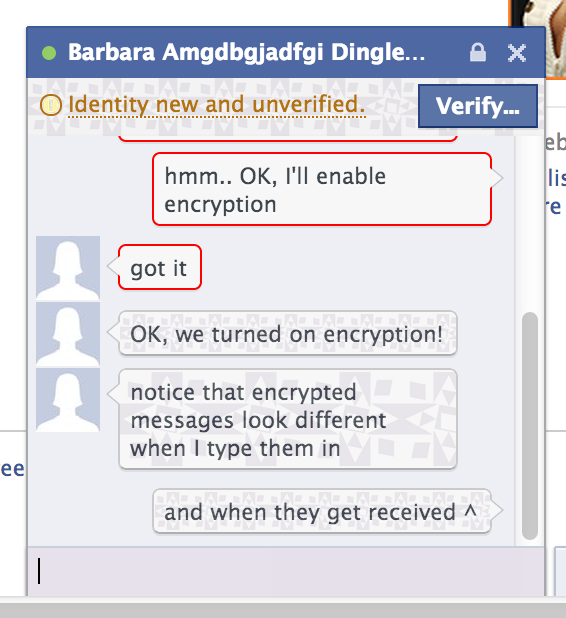</img>

A few things to note about the encrypted chat screen:
- Older unencrypted messages are now outlined in red, since you can't trust them compared to encrypted messages.
- Your security token is lightly patterned underneath the identity status bar at the top, and underneath each message you have sent or received. These watermarks are in place so that an attacker who controls the rest of Facebook's site can't fake your friend's messages or identity status.
- The area at the bottom where you type messages is tinted with your security color. It will only have that color when you're typing in it. It will also show a new security-colored token on the right as you edit your message, to show that we're still getting your message.

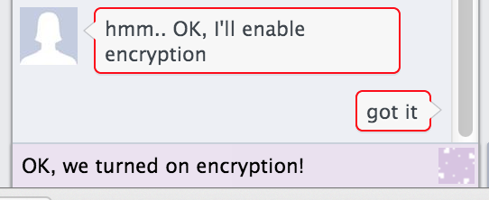</img>

Most important, both participants in this chat need to verify the other's identity! Otherwise, someone could just sit in the middle and have each side establish an encrypted connection with him, then read all the messages.

# Authentication

You have two options for *authenticating* your chat partner: fingerprint checking, and shared secret phrase authentication.

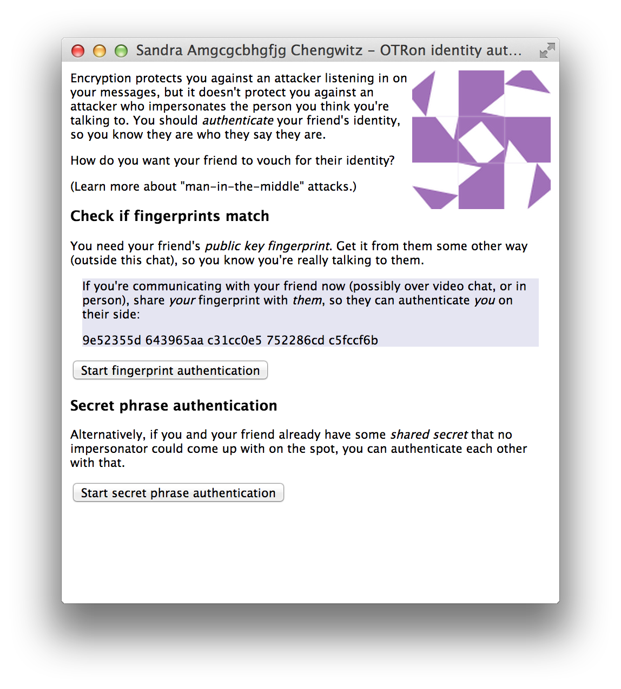</img>

We'll try fingerprint checking, and have both Sandra and Barbara start the process.

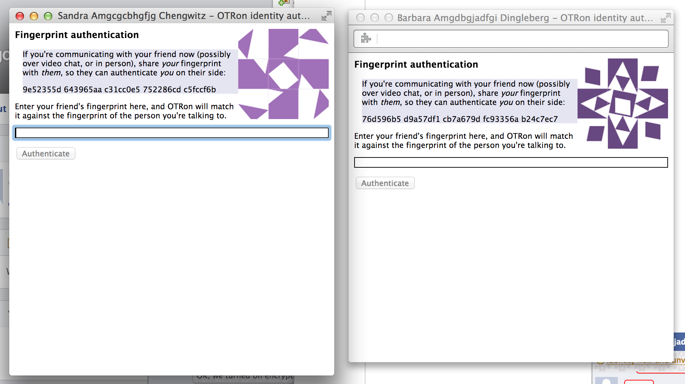</img>

<!-- TODO cover SMP -->

So each person needs to get their fingerprint to the other person by some other method (*not* the chat you're already on, since an imposter could just give you their fingerprint). Then they type that trusted fingerprint in. Here, Sandra and Barbara are on the same computer, so it's just a matter of typing what we see on the left on the right, and vice versa.

You won't be able to click "Authenticate" until the fingerprint you type in (from your friend outside) matches the one of the person you're chatting with. If it just won't match, you might be dealing with an imposter (or your friend has changed their key for this chat).

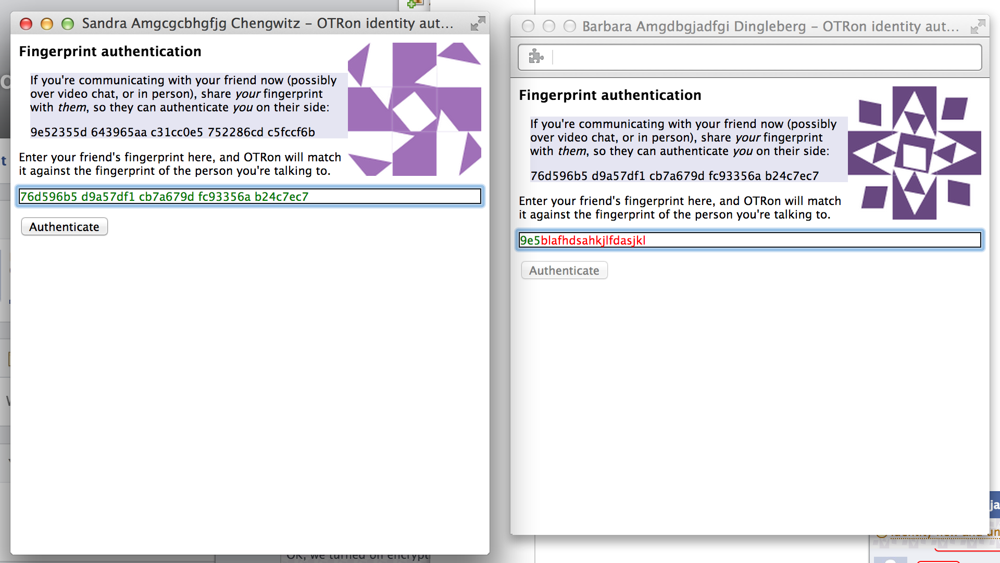</img>

Let's have Barbara authenticate Sandra, but not the other way around, for now.

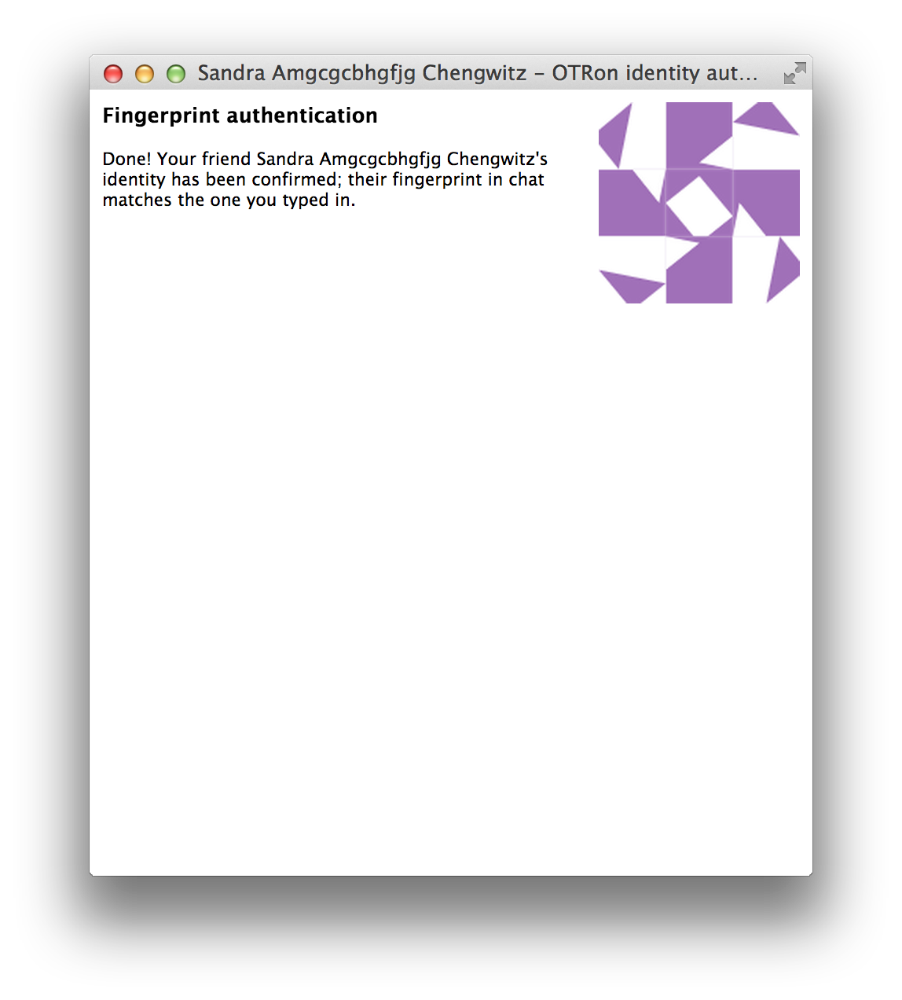</img>
</img>

# Options

What if Sandra wants to authenticate Barbara later, but the chat's over? You can view your known and trusted keys from the OTRon options page, and verify identities there:

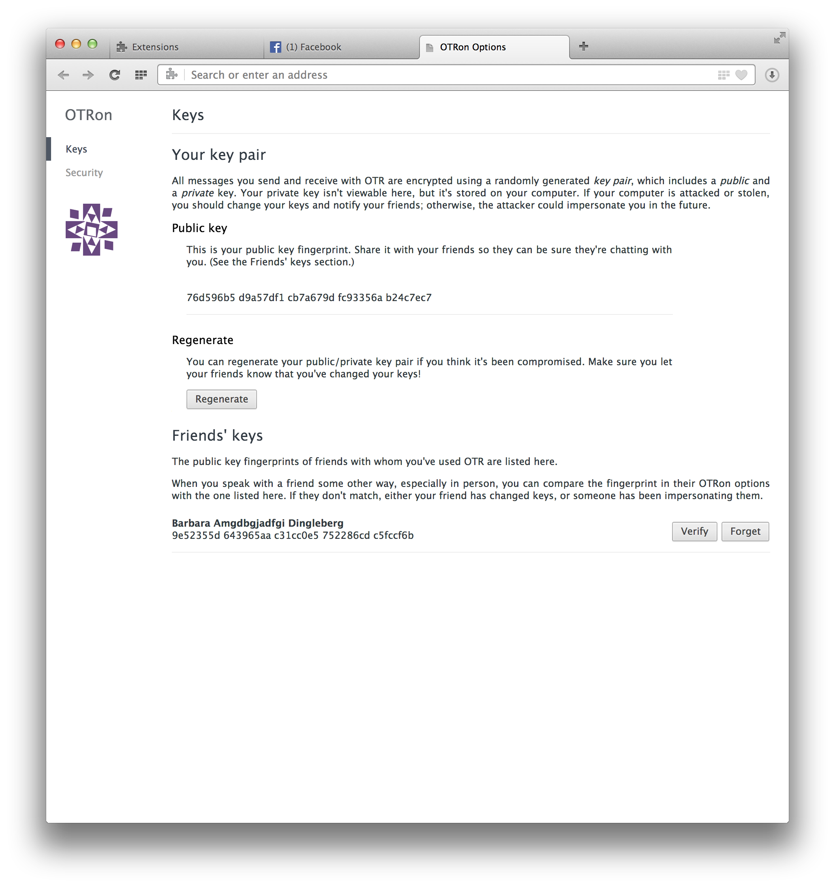</img>

# Conclusion
We've talked about three kinds of attack to which you may be subject, and the things you need to know to protect yourself:

- Passive interception (encryption and forward secrecy)

- Phishing and redress (security token and color)

- Man-in-the-middle (fingerprint or "socialist millionaire protocol" authentication)

There's more information on potential threats on the [threat model](threat-model.md) page.
