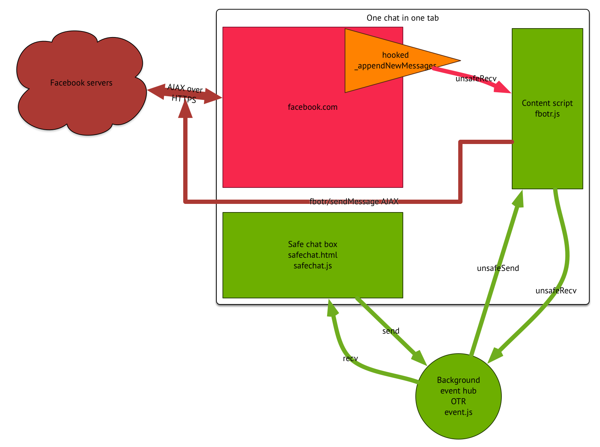

A simplified model of information flow in OTRon during an encrypted chat:

</img>

# Assumptions

## User

Let's assume the user has these objectives in their conversation.

1. Minimal change to existing routine. That is, if they use Facebook chat, they should be able to keep using Facebook chat.

2. Clearly delineated "encrypted" and "unencrypted" modes. The unencrypted mode should work even if their partner doesn't have OTR software.

3. If encrypted mode is on, the content of messages should not be accessible by anyone besides the conversation participants. (We assume both participants want this property.)

4. Earlier messages, especially messages in earlier conversations, should be unreadable. ("perfect forward secrecy")
   - Assumes that both participants do not keep logs of conversations

## Encryption

Let's also assume that Arlo Breault's [JavaScript OTR library](https://github.com/arlolra/otr) works according to the OTR protocol, and that the [OTR protocol](https://otr.cypherpunks.ca/) is sound. Then we get these properties "out of the box":
- Public key encryption
- Perfect forward secrecy
- Repudiable authentication of messages

So we have objectives 3 and 4 under control.

## Usage

Let's assume that:
- the user and their partner's computers are not compromised by malware.

# Threats

## Network connection
An attacker with control of the network can:
- see that user is connecting to Facebook
- (traffic analysis -- unusually big chat messages? not sure how this works)
- deny access to Facebook
but they likely won't have any way of knowing if/how a Facebook user is using OTRon.

An attacker who can see into the SSL connection to Facebook, perhaps through a forged certificate, can:
- see that the user is using OTR
- see time, (length?), and conversation partner for each encrypted message

If they can change packets in the connection:
- stop some or all encrypted conversations by dropping OTR messages
- man in the middle attack on the user's chat
  - if the user doesn't bother to authenticate their chat partner properly, or uses a guessable SMP phrase
- swap conversations (this seems like a good attack!) -- suppose you've talked to B and C, and authenticated both earlier, and you're talking to B; an attacker who has compromised C could then also compromise your conversation with B by swapping the user ID we scrape to C's and auth-ing as C
- add redress software to the FB client to trick you into carrying on what you think is an encrypted chat over compromised medium (layering elements on top of iframe, etc)
  - focus stealing from chat entry textbox
  - fake received message bubbles on top of the real chat iframe
  - (these are mitigated by the security tokens and color, but those require user attentiveness)

(TODO look at sslstrip / whole-site phishing attacks -- think OTRon just wouldn't kick in, and they couldn't fake the tokens)

## Facebook server
An attacker who has compromised Facebook's server during your conversation can:
- do all of the stuff in "Network connection"
- carry out more sophisticated network analysis (looking back at chat history, tracing user's friends and friends of friends) to find collaborators

Facebook has all your encrypted messages and associated metadata, but as long as the short-lived keys are destroyed properly, not much else.

## Extension
Various attacks:
- Google Chrome updated with an evil version (maybe Google's private key compromised, if they have to sign udpates?)
- key used to sign OTRon stolen from my computer, signs evil version of OTRon

## User
If a user has their computer compromised, or is otherwise turned after a conversation:
- private key easily taken -- stored in cleartext in extension local-storage
  - OTR conversations from then on with user's friends can be faked
- chat history analysis can be done on Facebook inbox

# Plausible attacks ruled out by assumptions earlier
- OTR implementation and protocol flaws

